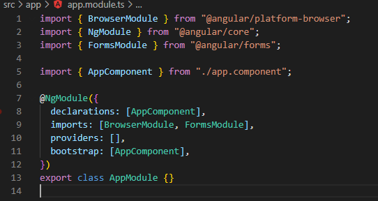

# Modules
ในทุกๆ Angular app จะ นั้นจะมี Ngmodule class อย่างน้อย หนึ่งclass เราจะเรียกมันว่า the root module โดยใช้ชื่อว่า AppModule แต่ในบาง app อาจจะมีมากกว่าหนึ่ง moduleก็เป็นได้ ทั้งนี้ทั้งนั้นขึ้นอยู่กับ Feature ของ app นั้นๆ ซึ่งเราสามารถเรียก NgModule ว่า root หรือ Feature ก็ได้ ซึ่ง class นั้นที่เป็น NgModule นั้นจะมี Decorator @NgModule นั้นกำกับไว้ด้วย

## NgModule — Unit of Compilation & Distribution
`NgModule` คือ `JavaScript Class` ที่ถูกเพิ่มความสามารถด้วย `Decorator` ที่มีชื่อว่า `@NgModule` โดยที่ `@NgModule` รับ `metadata object`    

> 💡 `Decorators` คือ ฟั่งชั่นๆ นึงที่ถูกดัดแปลงมาจาก JavaScript classes ซึ่งใน Angular นั้นก็มี decorators มากมายหลายตัวซึ่งในแต่ละตัวนั้นก็มีแนบ Metadata มาให้class นั้นๆด้วย ซึ่งจะทำให้รู้ว่าๆ class เหล่านั้นคืออะไร และทำงานอะไร
ศึกษาเพิ่มเติม เกี่ยวกับ [decoators](https://medium.com/google-developers/exploring-es7-decorators-76ecb65fb841)
>
> 💡 `Decorators` เป็นส่วนที่บอกคุณลักษณะของ component นั้นๆ

สิ่งสำคัญคือ `NgModule` มีไว้เพื่ออะไร NgModule ใช้ metadata เพื่อ
1. อธิบายวิธีการ Compile Components, Templates, Directives, Pipes ให้กับ Angular Compiler
2. ระบุ Components, Directives, Pipes ให้เป็นสาธารณะ (Public) ผ่าน metadata ที่มีชื่อว่า `exports` เพื่อให้ Module อื่น ที่ import Module นี้เรียกใช้งานได้
3. เพิ่ม Services หรือ Providers เพื่อใช้ Dependency Injection ใน Component ได้

> 💡 ทำความรู้จักกับ Webpack กันก่อน
>
> `Webpack` เป็น `module bundler` ครับ แปลง่ายๆ คือ เครื่องมือที่ใช้ในการรวม `module` ที่เราเขียน ให้เป็นไฟล์ที่เราจะนำไปใช้งานจริงๆ ความสามารถหลักๆของมันมีดังนี้ครับ
>- รวม `module` หลายๆ `module` ให้กลายเป็นไฟล์ๆเดียว (หรือมากกว่าก็ได้)
>- แปลง ES6, JSX, CSS เป็นต้น ให้สามารถใช้งานบน browser ทั่วไปได้

